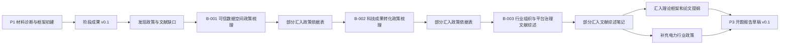

# 当前项目首页

本页是当前研究项目的网页入口。源文件仍保存在项目目录中，门户页面由 `scripts/build_research_portal.py` 同步生成。

<div class="research-status-grid">
  <div class="research-status-card"><strong>当前阶段</strong><span class="status-warn">P2 政策与文献补强前段</span></div>
  <div class="research-status-card"><strong>已完成</strong><span class="status-ok">P0 项目初始化；P1 材料诊断与框架初建；B-001 可信数据空间政策梳理</span></div>
  <div class="research-status-card"><strong>当前主线</strong><span>M-003 政策依据表补强；M-004 文献综述笔记补强</span></div>
  <div class="research-status-card"><strong>下一步</strong><span>汇入 B-001/B-002/B-003 机制结论；补充电力行业政策；启动 B-004 痛点研究</span></div>
</div>

## 快速入口

| 想看什么 | 入口 |
|---|---|
| 项目全貌 | [项目控制台](PROJECT_INDEX.md) |
| 当前该做什么 | [任务板](TASK_BOARD.md) |
| 已有哪些成果 | [成果物索引](ARTIFACTS.md) |
| 主线和支线怎么关联 | [主线-支线矩阵](MAIN_BRANCH_MAP.md) |
| 任务和成果物怎么关联 | [任务-成果物矩阵](TASK_ARTIFACT_MAP.md) |
| 哪些结论证据强/弱 | [证据状态](CLAIM_EVIDENCE_MAP.md) |
| 项目有什么风险 | [项目健康](HEALTH_CHECK.md) |

## 当前工作流



## 使用提示

每次主线或支线有新成果后，运行：

```bash
python3 scripts/build_research_portal.py
```

然后刷新本地门户即可看到最新状态。
