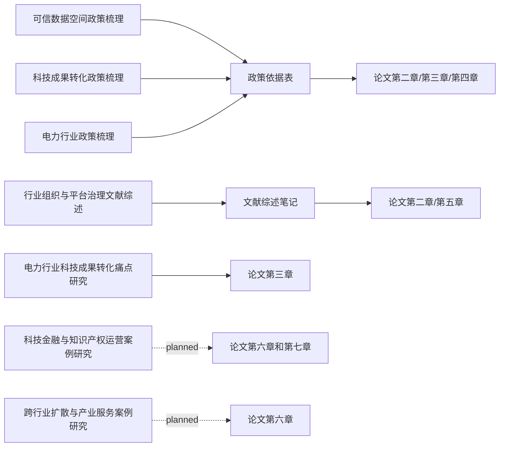

# 支线研究索引

本项目支线研究遵循工作区通用机制：

- `research-system/workflows/mainline-branch-workflow.md`
- `research-system/workflows/branch-integration-checklist.md`
- `research-system/templates/branch-template/`

## Mermaid 支线汇入图

## 支线清单

| 支线 | 状态 | 服务主线问题 | 服务主线文件/章节 | 是否已汇入主线 |
|---|---|---|---|---|
| 可信数据空间政策梳理 | completed | 可信数据空间如何支撑成果转化过程中的信任形成、数据协同和责任追溯 | `04_literature_policy/政策依据表.md`、论文第二章和第四章 | 部分汇入：政策依据表 |
| 科技成果转化政策梳理 | completed | 电力行业科技成果转化应依据哪些国家层面的成果转化、技术转移、成果评价、职务成果赋权、知识产权转化政策来设计运营模式 | `04_literature_policy/政策依据表.md`、论文第二章和第三章 | 部分汇入：政策依据表 |
| 行业组织与平台治理文献综述 | completed | 中电联作为行业组织在科技成果转化运营中应承担哪些角色 | `04_literature_policy/文献综述笔记.md`、论文第二章和第五章 | 部分汇入：文献综述笔记 |
| 电力行业政策梳理 | completed | 电力行业为什么需要依托可信数据空间开展科技成果转化场景运营 | `04_literature_policy/政策依据表.md`、论文第二章、第三章和第五章 | 部分汇入：政策依据表 |
| 电力行业科技成果转化痛点研究 | integrated | 电力行业科技成果转化当前面临哪些关键断点 | 论文第三章 | 已汇入：论文第三章、证据池、来源清单 |
| 科技金融与知识产权运营案例研究 | planned | 该运营模式如何实现可持续运行 | 论文第六章和第七章 | 否 |
| 跨行业扩散与产业服务案例研究 | planned | 该运营模式如何从行业内部转化扩展到跨行业服务 | 论文第六章 | 否 |

## 状态说明

| 状态 | 含义 |
|---|---|
| planned | 已规划，未开始 |
| in_progress | 正在研究 |
| completed | 支线成果已完成 |
| integrated | 已汇入主线 |
| superseded | 已被新支线或新版本替代 |
| dropped | 已取消 |
