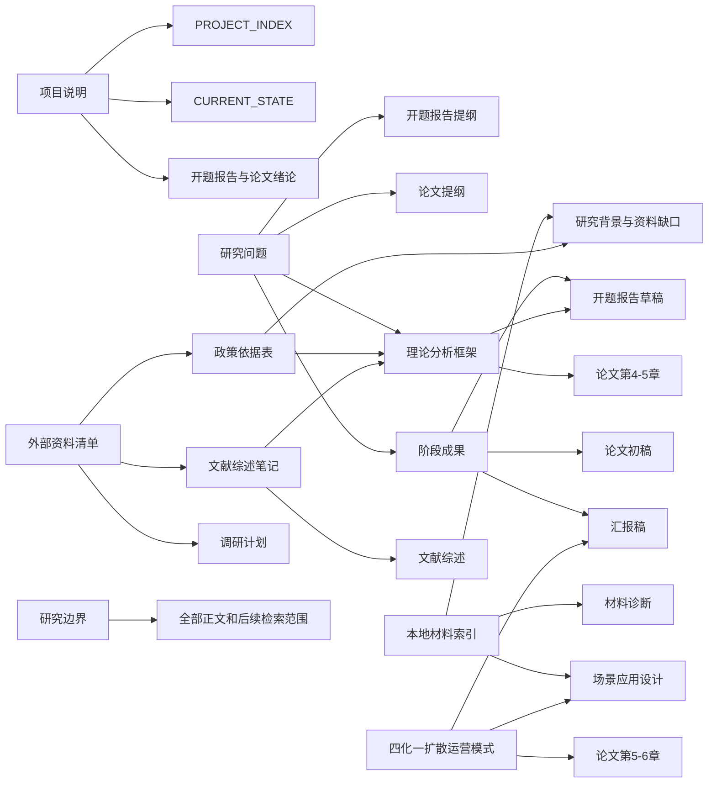

# 依赖关系图

本文件用于判断“前面成果物修改后，后面哪些文件需要同步调整”。

## Mermaid 依赖图

## 核心依赖表

| 上游成果物 | 主要内容 | 影响下游 |
|---|---|---|
| `00_project_brief/项目说明.md` | 项目名称、研究对象、研究主题、当前阶段 | `PROJECT_INDEX.md`、`CURRENT_STATE.md`、开题报告、论文绪论 |
| `00_project_brief/研究问题.md` | 核心研究问题、子问题、问题拆解 | 开题报告提纲、论文提纲、理论分析框架、阶段成果、摘要、结论 |
| `01_source_materials/local_materials_index.md` | 本地材料来源、用途、使用边界 | 材料诊断、场景应用设计、研究背景、资料缺口 |
| `01_source_materials/外部资料清单.md` | 待补政策、文献、案例、访谈资料 | 政策依据表、文献综述笔记、调研计划 |
| `02_stage_outputs/阶段成果_v0.1.md` | 当前阶段综合成果 | 开题报告草稿、论文初稿、汇报稿 |
| `03_outline/开题报告提纲.md` | 开题报告结构 | 开题报告草稿 |
| `03_outline/论文提纲.md` | 论文结构 | 论文初稿、章节写作计划 |
| `04_literature_policy/政策依据表.md` | 政策来源和支撑关系 | 研究背景、文献与政策基础、理论框架、风险边界 |
| `04_literature_policy/文献综述笔记.md` | 文献观点和研究缺口 | 文献综述、理论框架、研究创新点 |
| `05_models/理论分析框架.md` | 总体分析逻辑 | 开题报告、论文第 4-5 章、摘要、结论 |
| `05_models/四化一扩散运营模式.md` | 核心运营模式 | 论文第 5-6 章、场景应用设计、汇报 PPT |
| `研究边界.md` | 研究范围和不展开事项 | 全部正文和后续检索范围 |

## 常见修改的影响范围

### 修改研究问题

需要检查：

- `00_project_brief/研究问题.md`
- `02_stage_outputs/阶段成果_v0.1.md`
- `03_outline/开题报告提纲.md`
- `03_outline/论文提纲.md`
- `05_models/理论分析框架.md`
- `06_drafts/开题报告草稿.md`
- `06_drafts/论文初稿.md`

### 修改“四化一扩散”模式

需要检查：

- `05_models/四化一扩散运营模式.md`
- `05_models/理论分析框架.md`
- `03_outline/开题报告提纲.md`
- `03_outline/论文提纲.md`
- `02_stage_outputs/阶段成果_v0.1.md`
- 场景应用相关章节或草稿

### 补充新政策依据

需要检查：

- `04_literature_policy/政策依据表.md`
- `02_stage_outputs/阶段成果_v0.1.md` 中研究背景和政策基础部分
- `03_outline/开题报告提纲.md`
- `06_drafts/开题报告草稿.md`

### 补充新文献观点

需要检查：

- `04_literature_policy/文献综述笔记.md`
- `05_models/理论分析框架.md`
- `03_outline/论文提纲.md`
- `06_drafts/论文初稿.md`

### 调整研究边界

需要检查：

- `研究边界.md`
- `00_project_brief/项目说明.md`
- `00_project_brief/研究问题.md`
- `03_outline/论文提纲.md`
- `01_source_materials/外部资料清单.md`

## 使用方式

当修改任何上游成果时，先在 `REVISION_QUEUE.md` 新建修订项，再根据本文件列出影响范围。处理完成后，在 `CHANGELOG.md` 记录变更。
