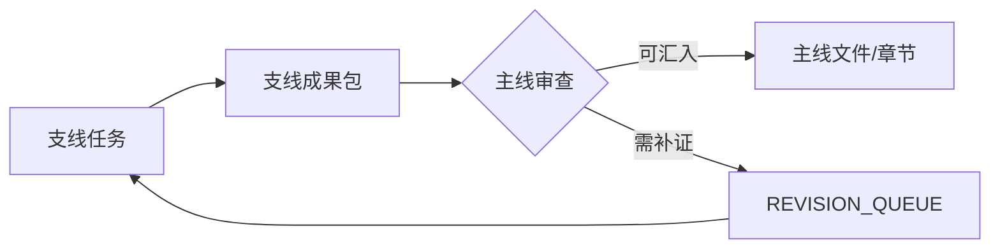

# 支线研究索引

## Mermaid 支线汇入图

| 支线 | 状态 | 服务主线问题 | 服务主线文件/章节 | 是否已汇入主线 |
|---|---|---|---|---|
| 待填写 | planned | 待填写 | 待填写 | 否 |

## 状态说明

| 状态 | 含义 |
|---|---|
| planned | 已规划，未开始 |
| in_progress | 正在研究 |
| completed | 支线成果已完成 |
| integrated | 已汇入主线 |
| superseded | 已被新支线或新版本替代 |
| dropped | 已取消 |
