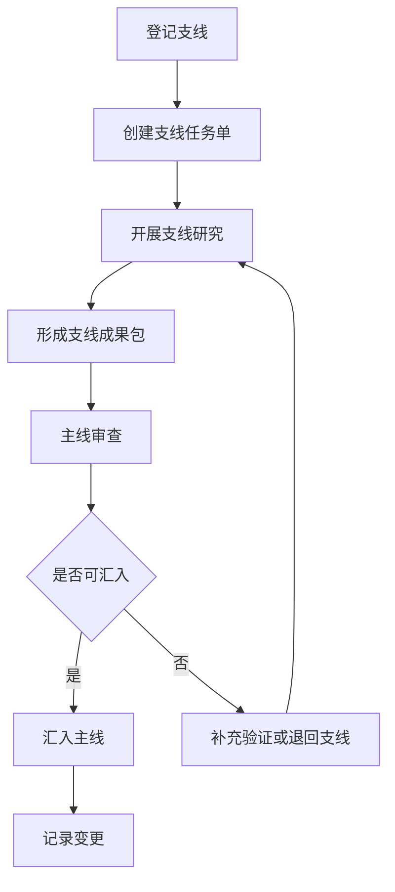

# 主线-支线研究工作流

## 一、适用场景

当主线研究推进过程中遇到需要单独深挖的问题时，启动支线研究。

典型支线包括：

- 政策梳理。
- 文献综述。
- 案例研究。
- 概念辨析。
- 技术机制分析。
- 调研设计。
- 数据分析。

## 二、角色分工

### 主线

负责：

- 研究方向。
- 核心问题。
- 理论框架。
- 论文提纲。
- 阶段成果。
- 最终稿件。

### 支线

负责：

- 对单一问题做深度研究。
- 提供证据表、结论摘要、对主线影响。
- 明确哪些内容可以汇入主线，哪些仍需验证。

## 三、标准流程

### Step 1：登记支线

在项目的 `07_branch_research/BRANCH_INDEX.md` 中登记支线。

记录：

- 支线名称。
- 服务主线问题。
- 目标章节或成果物。
- 状态。
- 负责人或执行方式。

### Step 2：创建支线任务单

每个支线必须有 `BRANCH_BRIEF.md`。

任务单应明确：

- 支线目标。
- 服务主线的具体位置。
- 需要回答的问题。
- 输出成果。
- 不研究什么。
- 质量标准。

### Step 3：开展支线研究

支线可以由 AI 单独展开，也可以由人补充资料后再让 AI 整理。

支线研究期间，默认只写入支线目录，不直接修改主线文件。

### Step 4：形成支线成果包

至少包含：

- `branch_report.md`
- `evidence_table.md`
- `implications_for_main.md`
- `handoff_to_main.md`

### Step 5：主线审查

主线读取 `handoff_to_main.md`，判断：

- 支线结论是否可靠。
- 证据是否足够。
- 是否改变研究问题。
- 是否改变理论框架。
- 是否需要调整提纲。

### Step 6：汇入主线

按照 `DEPENDENCY_MAP.md` 做影响分析，再更新对应主线文件。

### Step 7：记录变更

更新：

- `CHANGELOG.md`
- `PROJECT_INDEX.md`
- `CURRENT_STATE.md`
- `07_branch_research/BRANCH_INDEX.md`

## 四、支线状态

| 状态 | 含义 |
|---|---|
| planned | 已规划，未开始 |
| in_progress | 正在研究 |
| completed | 支线成果已完成 |
| integrated | 已汇入主线 |
| superseded | 已被新支线或新版本替代 |
| dropped | 已取消 |

## 五、禁止事项

1. 支线不得无边界扩展成新主线。
2. 支线不得直接覆盖主线基准成果。
3. 支线不得把未经验证的结论写入主线定稿。
4. 支线不得只给结论而不提供证据来源。
5. 主线不得吸收支线成果而不记录变更。
